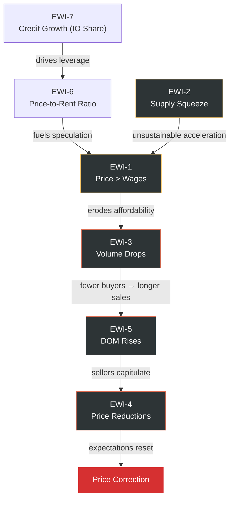

# Copenhagen Housing Market — Early Warning System

> **Version**: 0.1.0  
> **Last Updated**: 2026-06-11  
> **Depends on**: `architecture/market_framework.md`, `architecture/market_segmentation.md`  

> **Implementation note (2026):** This is the conceptual architecture document. The production implementation is in `server/cph_housing_server.py` and currently evaluates EWI-1 through EWI-9. `docs/model_governance.md` is normative for output semantics, payload freshness and ML publication rules; older examples in this document are not a claim that every proposed control is deployed.
> **MCP Server**: `CphHousingModel`

---

## 1. Purpose

This document defines a **structured early warning system** for detecting emerging housing market corrections in the Copenhagen metropolitan area. The system monitors five leading indicators, each grounded in the six-driver framework defined in [market_framework.md](file:///Users/ianropke/.gemini/antigravity/scratch/cph-housing-model/architecture/market_framework.md).

A market correction is defined as a **sustained real price decline of ≥5% from peak** within a 12-month window, or a **nominal price stagnation lasting ≥6 months** following a period of above-trend growth.

The system does **not** predict corrections — it detects the **preconditions** that historically precede them, giving 3–9 months of lead time for portfolio and decision adjustments.

---

## 2. Design Principles

| Principle | Implementation |
|---|---|
| **No single indicator triggers an alert** | Alerts require ≥2 concurrent amber signals or ≥1 red signal |
| **Segment-specific monitoring** | Each indicator is evaluated per (type × zone) cell, not metro-wide |
| **Historical calibration** | Thresholds are calibrated against 2006–2008 (pre-GFC peak), 2012 trough, and 2022 rate-shock episodes |
| **Lagging confirmation required** | Amber alerts auto-expire after 3 months without deterioration; red alerts require manual review |
| **Asymmetric sensitivity** | The system is tuned for **high recall** (catch all corrections) at the cost of some false positives |

---

## 3. Indicator Definitions

### 3.1 EWI-1: Price Growth Exceeding Wage Growth

> **Framework driver**: Purchasing Power (PP) — affordability erosion signal

#### Definition

Measures the **divergence between nominal housing price growth and nominal wage growth** over rolling windows. When prices persistently outrun wages, the buyer pool thins from the bottom up, creating a demand cliff that eventually manifests as a correction.

#### Metrics

| Metric | Calculation | Source |
|---|---|---|
| Price growth (YoY) | 12-month % change in segment price index | Boligsiden / DST (EJ56) |
| Wage growth (YoY) | 12-month % change in median disposable household income | DST (INDKP101) / Nationalbanken |
| Price-wage spread | Price growth − Wage growth (pp) | Derived |
| Cumulative excess | Rolling 24-month sum of positive price-wage spreads | Derived |

#### Signal Logic

```
┌─────────────────────────────────────────────────────────────┐
│  EWI-1: Price-Wage Divergence                               │
│                                                             │
│  GREEN:  Price-wage spread < 3pp for trailing 12m           │
│                                                             │
│  AMBER:  Price-wage spread ≥ 3pp for 2+ consecutive         │
│          quarters                                           │
│          OR cumulative excess > 15pp over 24 months          │
│                                                             │
│  RED:    Price-wage spread ≥ 5pp for 3+ consecutive          │
│          quarters                                           │
│          OR cumulative excess > 25pp over 24 months          │
│          OR price-to-income ratio > 1.5σ above 10-year mean  │
└─────────────────────────────────────────────────────────────┘
```

#### Transmission Mechanism

Price growth exceeding wage growth erodes **Purchasing Power (PP)**. The effect is non-linear — it's absorbed by credit extension (longer terms, IO periods) in early phases, but once credit tools are exhausted, the affordability ceiling becomes a hard constraint. The lag between affordability erosion and price correction is typically **6–12 months**, during which the market is sustained by momentum (Expectations driver) while the fundamental support weakens.

#### Historical Calibration

| Episode | Price-Wage Spread | Lead Time to Correction |
|---|---|---|
| 2006 Q3 – 2007 Q2 (pre-GFC) | +7–9pp sustained | 9 months before peak |
| 2017 Q4 – 2018 Q2 | +4pp transient | No correction (absorbed by rate cuts) |
| 2021 Q3 – 2022 Q2 | +8–12pp | 6 months before rate-shock correction |

---

### 3.2 EWI-2: Supply Falling While Demand Is High

> **Framework driver**: Supply Constraints (SC) × Expectations (EX) — bubble precondition signal

#### Definition

Measures the **simultaneous contraction of active listings while transaction volume remains elevated**. This indicates that sellers are withdrawing from the market (expecting higher future prices) or that absorption is so rapid that inventory cannot replenish — both conditions that create unsustainable price acceleration.

#### Metrics

| Metric | Calculation | Source |
|---|---|---|
| Active listings (segment) | Count of properties listed for sale at month-end | Boligsiden |
| Months of supply | Active listings ÷ trailing 3-month avg. transactions | Derived |
| Transaction volume (segment) | Monthly closed transactions | Boligsiden / Tinglysning |
| Listing inflow rate | New listings added per month | Boligsiden |
| Absorption rate | Transactions ÷ (active listings + new listings) | Derived |

#### Signal Logic

```
┌─────────────────────────────────────────────────────────────┐
│  EWI-2: Supply-Demand Imbalance                             │
│                                                             │
│  GREEN:  Months of supply within 1σ of 5-year segment mean  │
│                                                             │
│  AMBER:  Months of supply < 1σ below 5-year mean            │
│          AND transaction volume > segment median             │
│          AND listing inflow declining for 2+ months          │
│                                                             │
│  RED:    Months of supply < 2σ below 5-year mean             │
│          AND absorption rate > 80%                           │
│          AND new listing inflow at 3-year low                │
│          OR months of supply < 2.0 in any primary segment    │
└─────────────────────────────────────────────────────────────┘
```

#### Transmission Mechanism

Falling supply in a high-demand environment creates a **scarcity premium** that pushes prices above fundamental value. The mechanism:

1. Low inventory → multiple offers per listing → price escalation above ask
2. Price escalation → seller anchoring to new highs → further listing withdrawal
3. Positive feedback loop until external shock (rate hike, policy change) breaks the cycle

This indicator is particularly dangerous because it **feels healthy** — strong transaction volumes, fast sales, confident buyers — while building the conditions for a sharp reversal.

#### Segment Sensitivity

| Segment | Baseline Months of Supply | Red Threshold |
|---|---|---|
| Central apartments | 3.5 months | < 1.5 months |
| Frederiksberg apartments | 4.0 months | < 2.0 months |
| New Development apartments | 6.0 months | < 3.0 months |
| Bridge Quarter apartments | 4.5 months | < 2.0 months |
| Surrounding municipalities houses | 5.5 months | < 2.5 months |

---

### 3.3 EWI-3: Transaction Volume Dropping While Prices Rise

> **Framework driver**: Expectations (EX) × Purchasing Power (PP) — divergence signal

#### Definition

Measures the **divergence between price direction and transaction volume**, where prices continue rising but the number of completed transactions is declining. This is the classic "narrowing market" signal — prices are being set by a shrinking pool of increasingly stretched buyers, and the top of the market is approaching.

#### Metrics

| Metric | Calculation | Source |
|---|---|---|
| Transaction volume (segment, 3m MA) | 3-month moving average of closed sales | Boligsiden / Tinglysning |
| Volume YoY change | 12-month % change in transaction volume | Derived |
| Price index (segment) | Monthly price index | DST (EJ56) / Boligsiden |
| Price YoY change | 12-month % change in price index | Derived |
| Price-volume divergence | Sign(price change) ≠ Sign(volume change) for N months | Derived |
| Buyer composition shift | First-time buyer share; investor share | Boligøkonomisk Videncenter |

#### Signal Logic

```
┌─────────────────────────────────────────────────────────────┐
│  EWI-3: Price-Volume Divergence                             │
│                                                             │
│  GREEN:  Price and volume moving in same direction           │
│          OR divergence < 2 consecutive months                │
│                                                             │
│  AMBER:  Price rising (YoY > 0) AND volume falling           │
│          (YoY < -10%) for 3+ consecutive months              │
│          OR first-time buyer share declining > 5pp           │
│                                                             │
│  RED:    Price rising (YoY > 3%) AND volume falling           │
│          (YoY < -15%) for 4+ consecutive months              │
│          AND median transaction size increasing (only         │
│          expensive properties trading)                       │
│          OR volume < 25th percentile of 10-year              │
│          distribution while prices at > 75th percentile      │
└─────────────────────────────────────────────────────────────┘
```

#### Transmission Mechanism

This is the **most reliable leading indicator** of market turning points. The mechanism:

1. Prices rise → marginal buyers can no longer afford → they exit the market
2. Remaining buyers are wealthier / more leveraged → they sustain prices temporarily
3. Transaction volume falls → liquidity dries up → price discovery becomes unreliable
4. A demand shock (rate hike, sentiment shift) finds no marginal buyer → prices gap down

**Critical nuance**: Volume declines can also be caused by **supply withdrawal** (EWI-2), which is bullish. The model must distinguish between demand-driven volume declines (bearish: fewer buyers) and supply-driven volume declines (bullish: sellers holding). The differentiator is **listing inflow** — if listings are also falling, volume decline is supply-driven; if listings are flat or rising while volume falls, it's demand-driven.

#### Historical Calibration

| Episode | Volume Lead Time | Price Peak Lag |
|---|---|---|
| 2006 Q2 (volume peaked) → 2007 Q4 (price peaked) | **6 quarters** |
| 2022 Q1 (volume peaked) → 2022 Q3 (price peaked) | **2 quarters** (faster due to rate shock) |

---

### 3.4 EWI-4: Increasing Price Reductions

> **Framework driver**: Expectations (EX) — seller capitulation signal

#### Definition

Measures the **frequency and magnitude of listing price reductions** as a leading indicator of seller expectation adjustment. When an increasing share of sellers must reduce their asking price to attract buyers, it signals that seller expectations have overshot buyer willingness-to-pay — a precondition for broader price declines.

#### Metrics

| Metric | Calculation | Source |
|---|---|---|
| Price reduction rate | % of active listings with ≥1 price reduction | Boligsiden |
| Average reduction magnitude | Mean % reduction from original list price | Boligsiden |
| Cumulative reduction depth | For reduced listings: total % reduced from original ask | Derived |
| Time-to-first-reduction | Median days from listing to first price cut | Derived |
| Sale-to-original-ask ratio | Final sale price ÷ original listing price | Boligsiden |
| Multiple reduction rate | % of listings with ≥2 reductions | Derived |

#### Signal Logic

```
┌─────────────────────────────────────────────────────────────┐
│  EWI-4: Price Reduction Intensity                           │
│                                                             │
│  GREEN:  Price reduction rate < 25% of active listings       │
│          AND avg reduction magnitude < 3%                    │
│          AND sale-to-original-ask > 0.97                     │
│                                                             │
│  AMBER:  Price reduction rate > 30% for 2+ months            │
│          OR avg reduction magnitude > 5%                     │
│          OR sale-to-original-ask < 0.95                      │
│          OR time-to-first-reduction declining (sellers       │
│          cutting faster)                                     │
│                                                             │
│  RED:    Price reduction rate > 40% for 3+ months            │
│          AND avg reduction magnitude > 7%                    │
│          AND multiple reduction rate > 15%                   │
│          OR sale-to-original-ask < 0.90 for any              │
│          primary segment                                     │
└─────────────────────────────────────────────────────────────┘
```

#### Transmission Mechanism

Price reductions are a **direct measure of the gap between seller expectations and market clearing price**. The progression:

1. **Early stage**: Small share of overpriced listings reduced → normal market friction
2. **Acceleration**: Rising share of listings reduced; reductions happen faster after listing → sellers testing and failing at higher prices
3. **Capitulation**: Deep reductions, multiple cuts per listing, sale-to-ask falling below 0.90 → the market has turned and the price index will follow with a 1–3 month lag

**Asymmetry**: Price reductions are **stickier upward than downward**. In a rising market, the reduction rate can sit at 15–20% indefinitely (always some overpriced outliers). But when the rate crosses 30% and the trend is accelerating, it almost always precedes an index-level correction.

#### Segment Sensitivity

| Segment | Normal Reduction Rate | Amber Threshold |
|---|---|---|
| Central apartments | 15–20% | > 28% |
| Frederiksberg apartments | 18–22% | > 30% |
| New Development apartments | 10–15% (developer pricing) | > 25% |
| Bridge Quarter mixed | 20–25% | > 33% |
| Surrounding municipalities houses | 25–30% | > 38% |

> [!NOTE]
> New Development areas have a structurally lower baseline because developer pricing is more disciplined (cost-plus model). When New Development reduction rates rise, it's an especially strong signal because developers are absorbing margin rather than cutting prices publicly.

---

### 3.5 EWI-5: Increasing Time-on-Market

> **Framework driver**: Supply Constraints (SC) × Expectations (EX) — liquidity deterioration signal

#### Definition

Measures the **average and distribution of days-on-market (DOM)** for listed properties. Rising DOM indicates that the market's clearing speed is deteriorating — buyers are hesitating, supply is accumulating, and the balance of power is shifting from sellers to buyers.

#### Metrics

| Metric | Calculation | Source |
|---|---|---|
| Median days-on-market (segment) | Median DOM for properties sold in period | Boligsiden |
| DOM trend (3-month change) | Change in median DOM vs. 3 months prior | Derived |
| Stale listing rate | % of listings active for > 120 days | Boligsiden |
| DOM distribution skew | Right-tail weight of DOM distribution | Derived |
| Withdrawal rate | % of listings withdrawn (unsold, delisted) | Boligsiden |
| Fresh-to-stale ratio | Listings < 30 days ÷ listings > 90 days | Derived |

#### Signal Logic

```
┌─────────────────────────────────────────────────────────────┐
│  EWI-5: Time-on-Market Deterioration                        │
│                                                             │
│  GREEN:  Median DOM within 1σ of 24-month trailing mean     │
│          AND stale listing rate < 15%                        │
│          AND withdrawal rate < 5%                            │
│                                                             │
│  AMBER:  Median DOM > 1σ above 24-month mean for 2+ months  │
│          OR stale listing rate > 20%                         │
│          OR withdrawal rate > 8%                             │
│          OR DOM trend shows +15 days over trailing 3 months  │
│                                                             │
│  RED:    Median DOM > 2σ above 24-month mean                 │
│          AND stale listing rate > 30%                        │
│          AND fresh-to-stale ratio < 1.0 (more stale than     │
│          fresh)                                              │
│          OR median DOM exceeds segment historical maximum     │
│          from 2011–2012 trough                               │
└─────────────────────────────────────────────────────────────┘
```

#### Transmission Mechanism

Days-on-market is a **real-time barometer of market liquidity and buyer urgency**:

1. **Healthy market**: DOM is low and stable → buyers compete, properties sell quickly
2. **Cooling market**: DOM rises gradually → buyers have more options, take more time, negotiate harder
3. **Stalling market**: DOM rises sharply, stale listings accumulate → market psychology shifts from FOMO to caution
4. **Distressed market**: Withdrawals spike (sellers give up), remaining sales are forced/motivated → price floor breaks

**Seasonal adjustment required**: DOM has a strong seasonal pattern in Copenhagen (longer in winter, shorter in spring/early autumn). All signals must use seasonally adjusted DOM or compare to same-period prior year.

#### Segment Sensitivity

| Segment | Normal Median DOM | Amber Threshold |
|---|---|---|
| Central apartments | 45–65 days | > 85 days |
| Frederiksberg apartments | 50–70 days | > 90 days |
| New Development apartments | 30–50 days (pre-sale) / 60–90 days (resale) | > 100 days (resale) |
| Bridge Quarter apartments | 55–75 days | > 95 days |
| Bridge Quarter houses | 70–100 days | > 130 days |
| Surrounding municipalities houses | 80–120 days | > 150 days |
---

### 3.6 EWI-6: Price-to-Rent Ratio

> **Framework driver**: Local Substitution (LS) — speculative valuation signal

#### Definition
Measures the **divergence between segment property sale prices and residential rents**. Rents act as the fundamental yield anchor for housing. When purchase prices rise significantly faster than rents, it indicates speculative expectations of capital gains rather than demand for housing services, signaling potential bubble risk.

#### Metrics
- **Price Index**: Segment price index (EJ56).
- **Rent Index**: Average residential market rent index (Huslejeregisteret).
- **Price-to-Rent Ratio**: Price Index / Rent Index (normalized to historical average).

#### Signal Logic
- **GREEN**: Price-to-Rent ratio is within 1.5 standard deviations (\(\sigma\)) of the 5-year historical mean.
- **AMBER**: Price-to-Rent ratio is > 1.5\(\sigma\) above the 5-year mean.
- **RED**: Price-to-Rent ratio is > 2.5\(\sigma\) above the 5-year mean.

---

### 3.7 EWI-7: Credit Growth (Amortization-Free Share)

> **Framework driver**: Credit Conditions (CC) — credit vulnerability signal

#### Definition
Tracks the **share of new mortgage credit originations issued without amortization** (interest-only / IO loans). High reliance on interest-only loans indicates that buyers are using credit extension to bid up prices because they are stretched under traditional amortizing terms. This increases vulnerability to interest rate shocks and refinancing cliffs.

#### Metrics
- **Amortization-Free Share**: Share of new mortgage loans that are interest-only (from Finance Denmark table UL10).

#### Signal Logic
- **GREEN**: Interest-only share of new originations is < 50%.
- **AMBER**: Interest-only share of new originations is between 50% and 60%.
- **RED**: Interest-only share of new originations is >= 60%.

---

## 4. Composite Alert Dashboard

The seven indicators combine into a **composite early warning score** per segment:

### 4.1 Scoring

| Signal Level | Points |
|---|---|
| GREEN | 0 |
| AMBER | 1 |
| RED | 3 |

**Composite score** = sum across all 7 indicators (range: 0–21)

### 4.2 Alert Levels

```
┌──────────────────────────────────────────────────────────────┐
│  COMPOSITE EARLY WARNING LEVELS                              │
│                                                              │
│  SCORE 0–2:   🟢 NORMAL                                     │
│               Market operating within historical norms.      │
│               No action required.                            │
│                                                              │
│  SCORE 3–6:   🟡 ELEVATED                                   │
│               One or more stress indicators flashing.        │
│               Increase monitoring frequency.                 │
│               Review exposure to most-stressed segments.     │
│                                                              │
│  SCORE 7–11:  🟠 HIGH                                       │
│               Multiple concurrent stress signals.            │
│               Correction probability meaningfully above      │
│               base rate. Prepare contingency positioning.    │
│                                                              │
│  SCORE 12–16: 🔴 CRITICAL                                   │
│               Structural preconditions for correction are    │
│               in place. Historical analogues produced         │
│               corrections within 3–9 months.                 │
│               Activate defensive positioning.                │
│                                                              │
│  SCORE 17–21: ⚫ EXTREME                                     │
│               All indicators in stress. Correction is        │
│               likely in progress or imminent.                │
│               Maximum defensive posture.                     │
└──────────────────────────────────────────────────────────────┘
```

### 4.3 Cross-Segment Contagion Rule

If **≥3 segments** simultaneously reach 🟠 HIGH or above, the system escalates all remaining segments by one level (floor at ELEVATED). Rationale: broad-based stress indicates a systemic dynamic rather than segment-specific noise.

---

## 5. Indicator Interaction Map

The seven indicators are **not independent**. The typical progression in a developing correction:


**Typical sequencing** (with approximate lead times to price peak):

| Order | Indicator | Typical Lead Time |
|---|---|---|
| 1st | EWI-7 (Credit Growth / IO Share) | 18–24 months |
| 2nd | EWI-6 (Price-to-Rent Ratio) | 15–18 months |
| 3rd | EWI-1 (Price > Wages) | 12–18 months |
| 4th | EWI-2 (Supply squeeze / peak) | 9–12 months |
| 5th | EWI-3 (Volume drops) | 6–9 months |
| 6th | EWI-5 (DOM rises) | 3–6 months |
| 7th | EWI-4 (Price reductions) | 1–3 months |

> [!IMPORTANT]
> This sequencing is the **modal** pattern, not guaranteed. External shocks (rate hikes, policy changes) can compress the timeline to weeks, as seen in Q2–Q3 2022 when the ECB hiking cycle short-circuited the normal progression.

---

## 6. Data Pipeline & Refresh

| Indicator | Primary Data Source | Ingestion Format | Refresh Cadence | Lag |
|---|---|---|---|---|
| EWI-1 | DST (INDKP101, EJ56), Boligsiden | JSON (HTTP POST) | Monthly (prices), Annual (wages) | Wages: 3–6 month lag |
| EWI-2 | Finance Denmark RKR (UDB010) | JSON (HTTP POST) | Quarterly / Monthly | 1 month lag |
| EWI-3 | Finance Denmark RKR (BM011), DST | JSON (HTTP POST) | Quarterly / Monthly | 1 month lag |
| EWI-4 | Boligsiden (listing history) | CSV Ingestion | Monthly | Near real-time |
| EWI-5 | Finance Denmark RKR (UDB010) | JSON (HTTP POST) | Quarterly / Monthly | 1 month lag |
| EWI-6 | DST (EJ56) & Huslejeregisteret | JSON (HTTP POST) | Monthly / Annual | 1 month lag |
| EWI-7 | Finance Denmark RKR (UL10) | JSON (HTTP POST) | Quarterly | 1 month lag |

### MCP Server Integration

The `CphHousingModel` MCP server exposes:

```
check_early_warnings(segment_id) → {
    segment: string,
    evaluation_timestamp: ISO8601,
    indicators: {
        EWI-1_price_vs_wages: { level: "GREEN"|"AMBER"|"RED", price_growth_yoy: float, ... },
        EWI-2_supply_demand: { level: ..., months_of_supply: float, ... },
        EWI-3_volume_price_divergence: { level: ..., divergence: bool, ... },
        EWI-4_price_reductions: { level: ..., reduction_rate_pct: float, ... },
        EWI-5_time_on_market: { level: ..., median_dom_days: int, ... },
        EWI-6_price_to_rent: { level: ..., price_to_rent_ratio: float, ... },
        EWI-7_credit_growth: { level: ..., amortization_free_share_pct: float, ... }
    },
    composite_score: int,
    max_possible_score: 21,
    alert_level: "NORMAL"|"ELEVATED"|"HIGH"|"CRITICAL"|"EXTREME"
}
```

---

## 7. Limitations & Known Blindspots

| Blindspot | Mitigation |
|---|---|
| **Wage data lag** (EWI-1) | Use real-time payroll proxies (e-Indkomst if available) as leading estimate |
| **Seasonal noise** (EWI-5) | All DOM thresholds use seasonally adjusted values |
| **New Development pricing** (EWI-4) | Developer list prices are managed; track resale market separately for signal purity |
| **Policy shocks** | Not captured by any EWI — treated as exogenous scenario overlays |
| **Credit tightening** | Not a direct EWI but modelled in the framework (CC driver); consider adding EWI-6 for lending survey data |
| **Andelsbolig market** | Excluded from this system — cooperative housing has regulated pricing and different dynamics |

> [!WARNING]
> The early warning system is calibrated on a limited sample of Danish housing corrections (primarily 2008 and 2022). Copenhagen has experienced only two major corrections in 25 years. Threshold calibration is necessarily imprecise and should be reviewed after any new correction event.
