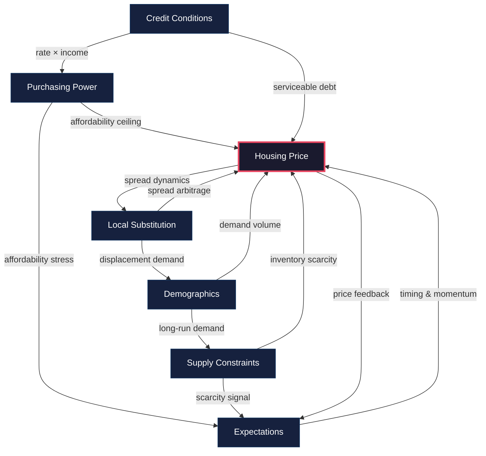

# Copenhagen Housing Market — Structural Framework

> **Version**: 0.1.0  
> **Last Updated**: 2026-06-11  
> **MCP Server**: `CphHousingModel`

---

## 1. Core Thesis

Housing prices in the Copenhagen metropolitan area are the equilibrium output of six interacting structural drivers. No single driver is sufficient to explain price dynamics; the model treats them as a **coupled system** where feedback loops, lags, and regime shifts generate non-linear price paths.

```
┌─────────────────────────────────────────────────────────────┐
│                    HOUSING PRICE (P)                        │
│                                                             │
│   P = f(PP, CC, SC, DG, EX, LS)                            │
│                                                             │
│   PP = Purchasing Power         CC = Credit Conditions      │
│   SC = Supply Constraints       DG = Demographics           │
│   EX = Expectations             LS = Local Substitution     │
└─────────────────────────────────────────────────────────────┘
```

---

## 2. The Six Structural Drivers

### 2.1 Purchasing Power (PP)

**Definition**: The aggregate capacity of buyer cohorts to service housing costs, measured as disposable income after tax, mandatory contributions, and essential consumption.

| Metric | Source | Frequency |
|---|---|---|
| Median disposable household income (DKK) | Danmarks Statistik (INDKP101) | Annual |
| Real wage growth (deflated by HICP) | DST / Nationalbanken | Quarterly |
| Price-to-income ratio (segment-specific) | Derived | Monthly |
| Debt service-to-income (DSI) ratio | Nationalbanken Financial Stability | Semi-annual |

**Transmission mechanism**: Rising real incomes → higher serviceable mortgage → upward bid pressure. The relationship is **concave** in high price-to-income regimes: marginal income gains produce smaller price effects when affordability is already stretched.

**Key non-linearity**: Tax reform shocks (e.g., changes to the property value tax / ejendomsværdiskat or the mortgage interest deduction / rentefradrag) create discrete jumps in effective purchasing power that the model must handle as regime breaks, not smooth trends.

---

### 2.2 Credit Conditions (CC)

**Definition**: The price, availability, and structure of mortgage credit available to buyers in the Danish market.

| Metric | Source | Frequency |
|---|---|---|
| 30-year fixed mortgage rate (realkreditlån) | Realkredit Danmark / Nykredit / Totalkredit | Daily |
| F1 / F3 / F5 adjustable rate (rentetilpasning) | Finans Danmark | Quarterly |
| Nationalbanken policy rate | Nationalbanken | Per meeting |
| Credit standards (lending survey) | Nationalbanken Udlånsundersøgelsen | Quarterly |
| Interest-only (afdragsfrit) share of new originations | Finans Danmark | Quarterly |
| LTV distribution of new loans | Finanstilsynet | Annual |

**Transmission mechanism**: Rate cuts → lower monthly payment for given loan amount → higher affordable price → upward pressure. The Danish system amplifies this through:

1. **Callable fixed-rate bonds**: Borrowers can refinance at par when rates fall, creating asymmetric rate sensitivity.
2. **Interest-only loans**: Extend affordability by deferring amortisation, but create cliff risks at IO expiry.
3. **Bidragssats (administration margin)**: Acts as a credit-condition floor that persists even when policy rates are zero.

**Lag structure**: Rate changes feed through with a 2–4 quarter lag for fixed-rate borrowers (requires refinancing event) but near-immediately for F1 adjustable borrowers at their annual reset.

---

### 2.3 Supply Constraints (SC)

**Definition**: The physical, regulatory, and temporal frictions that limit the responsiveness of housing supply to price signals.

| Metric | Source | Frequency |
|---|---|---|
| Building permits issued (Copenhagen Kommune) | DST (BYGV09) | Monthly |
| Housing completions by type | DST (BYGV06) | Quarterly |
| Zoning pipeline (lokalplaner under review) | Københavns Kommune Plan & Arkitektur | Irregular |
| Construction cost index | DST (BYGOMK1) | Quarterly |
| Active listings (segment-specific) | Boligsiden / Boliga | Monthly |
| Months of supply (listings / transaction rate) | Derived | Monthly |
| Average time-on-market (days) | Boligsiden | Monthly |

**Transmission mechanism**: Copenhagen has a **structurally inelastic** supply curve due to:

- **Geographic constraint**: Bounded by water on three sides (Øresund, harbour, lakes).
- **Regulatory constraint**: Heritage preservation (bevaringsværdige bygninger), building height limits, lengthy municipal planning processes.
- **Construction bottlenecks**: Labour shortages in skilled trades, material cost volatility, and long project timelines (3–5 years from permit to delivery).

This means that demand shocks translate primarily into **price** changes rather than **quantity** changes in the short and medium term. New supply (Nordhavn, Sydhavn, Ørestad) operates on a separate, long-lag pipeline.

---

### 2.4 Demographics (DG)

**Definition**: The size, composition, and migration dynamics of the population demanding housing in the Copenhagen metro area.

| Metric | Source | Frequency |
|---|---|---|
| Net migration into Copenhagen Kommune | DST (FLY) | Annual |
| International in-migration | DST (VAN5) | Quarterly |
| Household formation rate (age 25–34 cohort) | DST (FAM55N) | Annual |
| Population by age cohort | DST (FOLK1A) | Quarterly |
| University enrollment (KU, DTU, CBS, ITU, KEA) | Uddannelses- og Forskningsministeriet | Annual |
| Single-person household share | DST (BOL101) | Annual |

**Transmission mechanism**: Copenhagen has experienced sustained **positive net domestic and international migration** since 2010, driven by urbanisation preference among young professionals, university concentration, and public-sector / tech employment growth. This creates persistent demand-side pressure that operates on a **structural (multi-year) time horizon**.

**Key dynamics**:
- **Household fragmentation**: Rising single-person household share increases housing unit demand faster than population growth.
- **Cohort bulges**: Large cohorts entering prime household-formation age (28–35) create demand surges with 3–5 year visibility.
- **International elasticity**: Immigration policy changes (e.g., work permit rules, tax schemes like Forskerordningen) can shift demand materially over 12–24 months.

---

### 2.5 Expectations (EX)

**Definition**: Forward-looking beliefs of buyers, sellers, and lenders about future price trajectories, rates, and policy — acting as a self-reinforcing or self-correcting feedback loop.

| Metric | Source | Frequency |
|---|---|---|
| Consumer confidence (housing sub-index) | DST (FORV1) | Monthly |
| Buyer traffic index | Boligøkonomisk Videncenter | Quarterly |
| Price-to-asking-price ratio (final / listed) | Boligsiden | Monthly |
| Media sentiment index (housing coverage) | Derived (NLP on Danish media) | Weekly |
| Search volume ("bolig til salg København") | Google Trends | Weekly |

**Transmission mechanism**: Expectations operate through two channels:

1. **Demand pull-forward / deferral**: When buyers expect rising prices, they accelerate purchase timing (pull-forward), compressing time-on-market and pushing prices above fundamental value. The reverse creates stalling.
2. **Seller anchoring**: Listing prices reflect seller expectations of achievable price. In rising markets, ambitious listing prices create a ratchet effect; in falling markets, anchoring to past peaks extends time-on-market rather than clearing at lower prices.

**Regime sensitivity**: Expectations are the primary driver of **momentum** at the 6-month horizon and the primary source of **overshoot** at cycle peaks. The model must distinguish between extrapolative (trend-following) and adaptive (mean-reverting) expectation regimes.

---

### 2.6 Local Substitution (LS)

**Definition**: The competitive pricing dynamics between adjacent geographic segments and between asset types (apartment vs. house, owned vs. rented) that constrain arbitrage-free price spreads.

| Metric | Source | Frequency |
|---|---|---|
| Price ratio: Central Copenhagen / Frederiksberg | Derived from Boligsiden | Monthly |
| Price ratio: Central Copenhagen / Bridge Quarters | Derived | Monthly |
| Price ratio: Apartment / house (m² basis) | Derived | Monthly |
| Rent-to-price yield by segment | Derived (Huslejeregisteret + Boligsiden) | Quarterly |
| Cross-bridge commute time (Øresund / harbour) | Rejseplanen | Stable |
| Metro proximity premium (before/after station openings) | Derived event study | Per event |

**Transmission mechanism**: Housing segments are **imperfect substitutes** connected by price spreads that reflect quality, location, and access differentials. When spreads widen beyond historical norms:

- **Outward substitution**: Buyers priced out of Central Copenhagen shift demand to Frederiksberg, Bridge Quarters, and surrounding municipalities (Gentofte, Gladsaxe, Hvidovre).
- **Type substitution**: Price-compressed apartment buyers consider row houses (rækkehuse) in near-suburbs.
- **Tenure substitution**: At extreme price-to-rent ratios, marginal buyers remain renters, capping owned-segment demand.

**Infrastructure shocks**: Metro extensions (Cityringen, M4 Sydhavn) and bridge/tunnel connections permanently re-price the substitution map by reducing commute-time differentials.

---

## 3. Forecast Horizons

The model operates at three distinct temporal horizons, each governed by a different dominant driver set and modelling approach.

### 3.1 Short-Term: 6 Months

> **Dominant drivers**: Momentum, Active Supply, Time-on-Market

| Driver | Mechanism | Lead indicator |
|---|---|---|
| **Momentum (EX)** | Extrapolative expectations and trend persistence | Trailing 3-month price change; buyer confidence index |
| **Active Supply (SC)** | Current inventory pressure | Months of supply; new listings flow |
| **Time-on-Market (SC)** | Market clearing speed as demand barometer | Median days-on-market; sale-to-list ratio |

**Modelling approach**: Primarily **statistical / time-series** (VAR, ARDL) with high-frequency inputs. Structural drivers are treated as quasi-fixed boundary conditions. The 6-month forecast answers: *"Given current market temperature and inventory, where does inertia carry prices?"*

**Key risk**: Momentum models are **fragile at turning points**. The model must incorporate regime-detection (e.g., Markov-switching) to flag when momentum signals are likely to reverse.

---

### 3.2 Medium-Term: 12 Months

> **Dominant drivers**: Affordability, Interest Rates, Credit Conditions

| Driver | Mechanism | Lead indicator |
|---|---|---|
| **Affordability (PP × CC)** | Joint effect of income and rates on serviceable price | DSI ratio; price-to-income ratio |
| **Interest Rates (CC)** | Mortgage rate trajectory | Forward rate curve; ECB/Nationalbanken guidance |
| **Credit Conditions (CC)** | Lending standards and product availability | Lending survey net tightening; IO share trend |

**Modelling approach**: **Semi-structural** — combining affordability ratios with a credit impulse model. The 12-month forecast answers: *"Given the rate and income trajectory, what is the affordability-consistent price level?"*

**Key interaction**: Rates and purchasing power interact multiplicatively. A 100bp rate increase has a larger price effect when price-to-income ratios are elevated (high leverage amplifies rate sensitivity).

---

### 3.3 Long-Term: 24 Months

> **Dominant drivers**: Structural Demography, New Construction Pipeline

| Driver | Mechanism | Lead indicator |
|---|---|---|
| **Demography (DG)** | Population growth and household formation trajectory | Net migration trend; cohort projections |
| **New Construction (SC)** | Pipeline delivery absorbing or exceeding demand growth | Permits issued 18–24 months prior; completions trajectory |
| **Structural policy (PP/CC)** | Tax reform, LTV regulation, pension changes | Legislative pipeline; political cycle |

**Modelling approach**: **Structural / equilibrium** — the 24-month forecast estimates where the supply-demand balance settles after cyclical noise dissipates. It answers: *"Is Copenhagen structurally under- or over-supplied relative to population-driven demand?"*

**Key calibration**: The long-term forecast must account for the **pipeline overshoot risk** — periods where large-scale projects (Nordhavn, Sydhavn, Ørestad) deliver simultaneously, creating temporary localised oversupply even as aggregate metro demand remains robust.

---

## 4. Driver Interaction Map



---

## 5. Data Pipeline Contract

All drivers feed into the `CphHousingModel` MCP server through standardised ingestion:

| Layer | Format | Refresh |
|---|---|---|
| Raw series | Parquet / CSV via DST API, Boligsiden API | Per source cadence |
| Transformed features | Typed feature store (driver × segment × horizon) | Daily rebuild |
| Model inputs | Feature vectors aligned to forecast date | At forecast time |

Each driver module exposes:
- `get_latest(driver, segment)` → most recent observation
- `get_history(driver, segment, start, end)` → time series
- `get_forecast_features(driver, segment, horizon)` → model-ready vector

---

## 6. Model Governance

| Principle | Implementation |
|---|---|
| **No black-box forecasts** | Every forecast decomposes into driver contributions |
| **Horizon-appropriate complexity** | 6m: statistical; 12m: semi-structural; 24m: structural |
| **Regime awareness** | Markov-switching and breakpoint detection at all horizons |
| **Segment specificity** | No metro-wide average forecasts; always segment-level |
| **Backtesting discipline** | Rolling out-of-sample evaluation; no in-sample cherry-picking |

---

## 7. User Cost of Housing & Geographic Credit Asymmetry

### 7.1 User Cost Formula
The User Cost of Housing (UC) measures the net cost of owning and occupying a property. It integrates mortgage costs, tax benefits, property taxes, depreciation, a housing risk premium, and expected price changes:

\[UC = P_H \times [r(1 - \tau_r) + \tau_p + \delta + rp - \pi_e]\]

Where:
- \(P_H\): Property market value.
- \(r\): Mortgage interest rate.
- \(\tau_r\): Effective marginal tax deduction rate for interest expenses (rentefradrag).
- \(\tau_p\): Property tax rate (ejendomsskat + grundskyld).
- \(\delta\): Maintenance and physical depreciation rate.
- \(rp\): Housing risk premium (compensation for illiquidity and price volatility).
- \(\pi_e\): Expected annual price appreciation.

### 7.2 Dynamic Tax Deduction (\(\tau_r\)) Brackets
The Danish interest deduction rate (\(\tau_r\)) is calculated dynamically based on total annual interest expenses on an 80% LTV mortgage:
- **Deduction rate**: 33% for interest expenses below the threshold; 25% for expenses above the threshold.
- **Thresholds**: 50,000 DKK per year for single buyers; 100,000 DKK per year for couples.

For an interest expense \(I\):
- If \(I \le \text{Threshold}\): \(\tau_r = 0.33\)
- If \(I > \text{Threshold}\): \(\text{Benefit} = (\text{Threshold} \times 0.33) + ((I - \text{Threshold}) \times 0.25)\), and the effective rate is \(\tau_r = \text{Benefit} / I\).

### 7.3 Asymmetric Geographic Credit Elasticity
Geographic segments in Copenhagen exhibit asymmetric sensitivities and transmission speeds (lags) in response to credit shocks (mortgage rate shocks):

- **Central Copenhagen (e.g., postal code 2100 - Apartments)**: High interest rate elasticity (\(\beta = -4.5\)) due to high affordability pressure and leverage. Credit shocks transmit instantly (0-quarter lag, full transmission at 6m).
- **Frederiksberg (e.g., Apartments)**: High interest rate elasticity (\(\beta = -4.0\)) with instant transmission (0-quarter lag).
- **Surrounding Municipalities / Suburbs (e.g., postal code 2600 - Houses)**: Lower interest rate elasticity (\(\beta = -2.5\)) due to lower starting price-to-income and more stable buyer demographics. Credit shocks transmit slowly with lags (only 25% at 6m, 75% at 12m, 100% at 24m).
